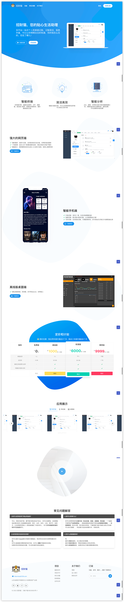

# Smart miao
招财猫-您的私人理财专家，丰富的记账功能，助你养成良好的记账习惯。便捷的卡证照管理，打印、分享更加快捷高效。

做就做全套：网页端、移动端、桌面端多端开发，免费视频教程、免费营销网站、免费AE产品宣传视频、甚至是教你申请著作权......

> 如果你是UI设计师，喜欢这个项目并希望贡献自己的能力，你出图，我来实现，love~

> AE视频模板等资源太大，就不放到代码管理了，网盘也白瞎，有需要可以提issue，写上你的邮箱，我会尽快发给你～

演示环境及账号密码：https://demo.smartmiao.com

| 账号    | 密码   | 权限        |
|-------| ------ |-----------|
| admin | 123456 | 全部功能      |
| test  | 123456 | 拥有少部分菜单权限 |

## 应用截图

 

## 平台目录
- [x] backend：基于`Egg.js 2.x`和`nodejs 16.x`的后端工程
- [x] frontend：基于`Vue.js 2.x`的前端工程
- [x] app：基于`Uniapp、uviewui 1.x`的移动端工程
- [x] web：基于`Bulma.css 0.9.x`的产品营销网站
- [x] desktop：基于`Electron 16.x`和`electron-forge`的桌面工程，请查看另一个开源项目
[LanMiaoDesktop](https://github.com/hilanmiao/LanMiaoDesktop) 的 `online` 分支

## 功能
- [x] 系统管理-用户管理
- [x] 系统管理-角色管理
- [x] 权限管理-菜单管理
- [ ] 权限管理-操作管理
- [ ] 权限管理-页面元素管理
- [ ] 权限管理-文件管理
- [x] 系统监控-在线用户
- [x] 系统监控-登录日志
- [x] 系统监控-服务监控
- [x] 消息通知
- [x] 登录-Token、RefreshToken
- [x] 登录-账号密码登录
- [ ] 登录-手机短信登录
- [ ] 登录-Github、微信、钉钉第三方登录
- [ ] 登录-app扫码登录
- [x] 个人中心
- [ ] 注册
- [x] 卡证照管理
- [x] 记账
- [ ] 智能提醒
- [ ] 运维-数据备份
- [ ] 运维-版本管理
- [ ] 增强网站无障碍功能的
- [x] 应用链接-YApi、MinIO、开发手册

## 教程
请查阅每个工程下面的`Readme`文件，另外 [全栈小白开发手册](https://hilanmiao.github.io/standards-recommendations/) 对你也许有用

## 赞助

如果你喜欢它,不妨给它点个`star`或者请我喝杯咖啡

<table>
 <tr>
    <th>支付宝</th>
    <th>微信</th>
 </tr>
  <tr>
    <td valign="top">
        
    </td>
    <td valign="top">
        
    </td>
  </tr>
</table>

## 开源协议

本项目基于 [MIT](http://opensource.org/licenses/MIT) 协议，请自由地享受和参与开源。

## 贡献

如果你有好的意见或建议，欢迎给我们提 [issue] 或 [PR]，贡献你的力量

[PR]: https://gitee.com/XiaoLanMiao/smart-miao/pulls

[issue]: https://gitee.com/XiaoLanMiao/smart-miao/issues

## 致谢

- [vue-element-admin](https://github.com/PanJiaChen/vue-element-admin)
- [sf-vue-admin](https://github.com/hackycy/sf-vue-admin)
